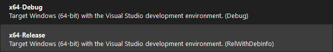

# 🛰️ Parallel Satellite Simulation

### Programming Languages & APIs


### Simulation & Graphics


### IDE & Environment


### Performance & Acceleration


### Academic Context


---

## Serial → OpenMP → OpenCL

**High-Performance Gravitational Simulation using CPU Multithreading and GPU Acceleration**  
**By:** Mehdi Moallemkolaei and Ashfak Nehal (_Parallel Computing 2025 Project - Tampere University_)

---

## Overview

This project simulates the gravitational interaction of multiple satellites orbiting a black hole using various parallel programming techniques. It was developed as part of a university course on **Parallel Computing**, evolving from a **baseline serial implementation in C**, to **CPU parallelism using OpenMP**, and finally to **GPU acceleration with OpenCL**.

The simulation includes real-time visualization with [**SDL2**](https://github.com/libsdl-org/SDL/releases/tag/release-2.32.10), making the dynamic orbital paths observable as you interact with the black hole center using your mouse.


---

## Motivation

Simulating gravitational forces between N bodies is a classic **O(N²)** computational problem. This makes it an excellent candidate for **parallel computing**. The goal was to:

- Understand thread-level and data-level parallelism
- Implement a real-time simulation with responsive controls
- Analyze speedups and scalability on both CPU and GPU

---

## Evolution of the Project

| Stage | Description |
|-------|-------------|
| `cpu/` | Basic serial version in C |
| `openmp/` | Optimized with OpenMP for CPU multithreading |
| `opencl/` | GPU-accelerated using OpenCL kernels |

Each version maintains the same physics core and graphical interface, enabling direct benchmarking.

---

## Technical Stack

| Programming | Parallelism | Graphics | Simulation | IDE | Platform | GPU | CPU |
|-------------|-------------|-----|------------|-----|----------|----------|-----|
| C / C++ | OpenMP | OpenCL | SDL2 | Visual Studio | Windows 11 | NVIDIA RTX 4070 | Intel Core i7-13700 @ 2.10 GHz |

---

## Controls

- 🖱️ Mouse position: sets the black hole’s gravity center
- ⌨️ ESC / `Q`: exits simulation

---

## Performance Benchmarks

Benchmarks were conducted by measuring average frame compute time over fixed simulation durations. Below is a summary (example values):

| Version     | Time (ms/frame) | Relative Speedup |
|-------------|------------------|------------------|
| Serial C    | ---              | xxx            |
| OpenMP      | ---              | xxx            |
| OpenCL GPU  | ---              | xxx          |

> GPU acceleration showed over **23× speedup** compared to the serial version.

---

## Challenges Faced

- Handling thread race conditions with OpenMP loops
- Managing OpenCL platform/device/kernel initialization on different machines
- Tuning work-group sizes for maximum GPU throughput
- Balancing compute vs render time to maintain real-time responsiveness

---

## Build Instructions

### Windows (Visual Studio with MSVC)

1. Clone repo and open each project file separately (each folder under [src](src)) 
2. Ensure OpenCL SDK is installed and linked in project properties.
3. Ensure to extract the SDL2 Package (from [HERE](src/SDL2)) and include it inside each project folder you want to run. (each project folder needs this package to build and run the program.)
4. simply use Visual Studio to Build and Run the `Parallel.exe`.


### Linux (optional) - Not Tested!

```bash
sudo apt install build-essential cmake libsdl2-dev ocl-icd-opencl-dev
cmake -B build -DCMAKE_BUILD_TYPE=Release
cmake --build build
./build/Satellites
```

### Compiler Optimizations
1. In VS Settings, you can choose X64-Release instead of X64-Debug. This improves the performance by x2 times. Alternatively, you can copy this [`CMakeSettings.json`](src/VS-CMakeSetting/CMakeSettings.json) file, and include it inside your project folders, near `.c` file.



2. Also, to improve the preformance, it is possible to activate some related and useful flags inside the `CMakeLists.txt` file for each implementation of the project (OpenMP/OpenCL). This file is necessary for running the project, so it is already included in the project files.

---

## Repository Structure

```
src/
├── cpu/            # Serial and Basic version
├── openmp/         # OpenMP-parallel version
├── opencl/         # GPU-accelerated version
├── SDL2            # SDL2 Paackage for Visualization
└── VS-CMakeSetting # CMake Setting file

docs/
├── images/    # Screenshots and visual assets
└── results/   # Benchmark plots and Reports
```

---

## License

This project is licensed under the MIT License.

---

## Authors

**Mehdi Moallemkolaei**  
Master’s Student in Embedded Systems – Tampere University  

**Md Ashfak Haider Nehal**  
Master’s Student in Embedded Systems – Tampere University  
